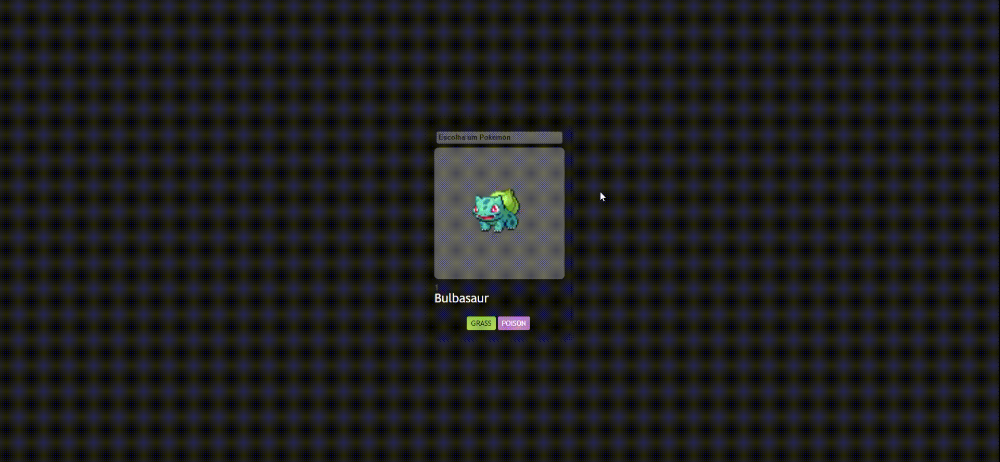

# DIO - Card Pokemon com Angular

Este projeto foi realizado utilizando [Angular CLI](https://github.com/angular/angular-cli) v17.0.6.

## Criando o Servidor de desenvolvimento

Execute `ng serve` para criar um servidor de desenvolvimento. Navegue até `http://localhost:4200/`. A aplicação será automaticamente recarregada e irá exibir o Card com a funcionalidade de Busca

## Executando testes unitários

Execute `ng test` para executar os testes unitários via [Karma](https://karma-runner.github.io). nele poderemos testar componentes e se estão exibindo os dados corretamente.
